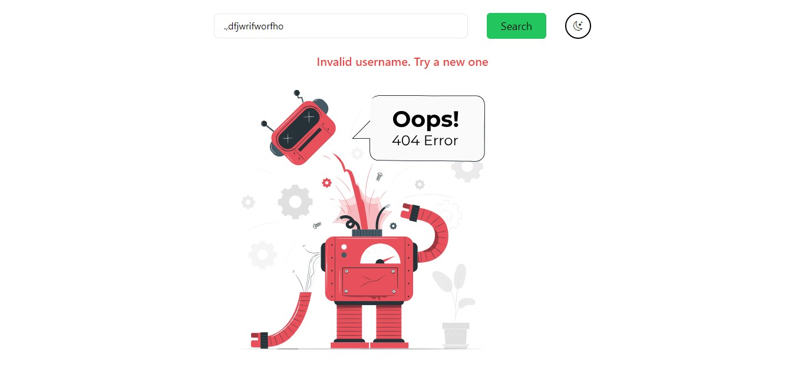
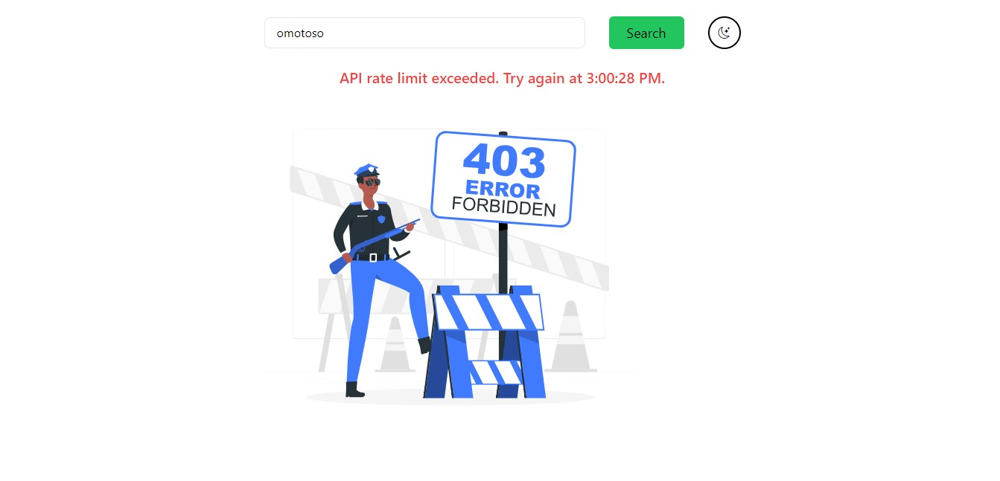

# GitHub User Profile Search

This web app lets users search GitHub profiles and repositories, displaying data from the GitHub API while handling rate limits and errors smoothly.

## Table of Contents

- [Introduction](#introduction)

- [Screenshots](#screenshots)

- [Installation](#installation)

- [Usage](#usage)

- [Technologies Used](#technologies-used)

- [Features](#features)

- [Contributing](#contributing)

### Introduction

Github user profile search( web app) provides a comprehensive interface for retrieving and displaying detailed information from the GitHub API based on a user’s search input. Users can enter a GitHub username to access and view the user's profile, including avatar, bio, location, and a list of public repositories. The application is designed to handle various edge cases, such as API rate limits, ensuring that users are informed when the limit is exceeded. Additionally, it manages potential errors, such as invalid usernames or unauthorized access, offering a smooth and intuitive user experience while navigating through the search results.

### Screenshots

Explore a preview of the web application's interface.

### Installation

To run the application, follow these steps:

1. Clone the repository using
 `git clone https://github.com/omotosodavid/github-user-profile-search.git`

2. Navigate to the project directory:
`cd github-user-profile-search`

3. Install the required packages by running
`npm install`
 or
 `yarn install`
 in your terminal.

4. Start the application with
`npm run dev`
 or
 `yarn dev`

5. Open your web browser and navigate to
`http://localhost:3000`
 to access the application.

### Usage

- Enter a GitHub username in the search bar to view the user's profile and
repositories.

- Click on a repository to view its details.

- The application handles API rate limits and potential errors, ensuring a smooth user experience.

- Users are informed when the API rate limit is exceeded.

- The application manages invalid usernames, unauthorized access scenarios and informs the user on what is going on.

### Technologies Used

- **Next.js**: A React framework for server-side rendering and building web applications.

- **TypeScript**: A superset of JavaScript that adds types to the language.

- **Tailwind CSS**: A utility-first CSS framework for rapid UI development.

- **Axios**: A promise-based HTTP client for the browser and Node.js.

- **GitHub API**: To retrieve user profile and repository data from GitHub.

### Features

- **Search GitHub User**: Users can search for a GitHub user's profile by entering a username in the search bar.

- **Display User Profile**: The application fetches and displays the user's profile information including their name, number of repositories, location, and bio.

- **Display Repositories**: The application fetches and displays the user's repositories, including their names, descriptions, number of stars and forks.

- **Pagination**: View repositories page-by-page with "Next" and "Previous" buttons.

- **Handle API Rate Limits**: The application handles API rate limits by displaying a message when the rate limit is reached.

- **Handle API Errors**: The application handles API errors by displaying an error message.

-**Dark Mode**: The application supports theme switching between light and dark modes, which is persisted in local storage.

- **Design**: The search results are displayed in a user-friendly format, the application is designed to be responsive and accessible on various devices.

### Contributing

Contributions are always welcomed! If you find any issues or have suggestions for improvements, feel free to open an issue or submit a pull request.

### License

This project is licensed under the MIT License - see the [LICENSE](./LICENSE) file for details.
